# Assingment 8
# Infrastructure Workflow
- Created AWS access key and configured it in Terraform variables
- Provisioned a custom VPC using Terraform
- Created public and private subnets
- Deployed EC2 instances inside the VPC
- Built a GitHub Actions workflow to verify EC2 connectivity

# Screenshots
## Terraform Apply
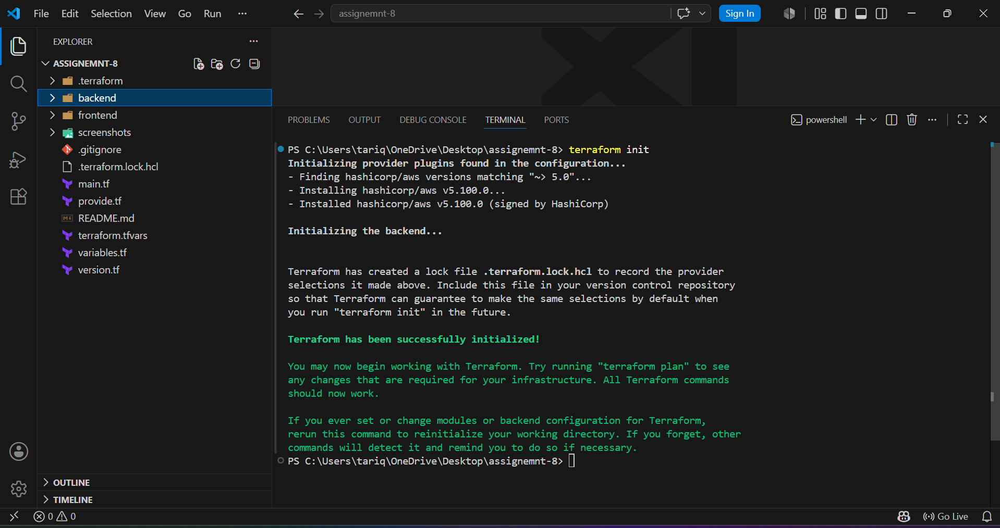
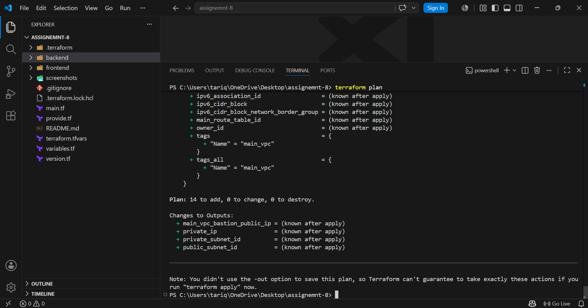
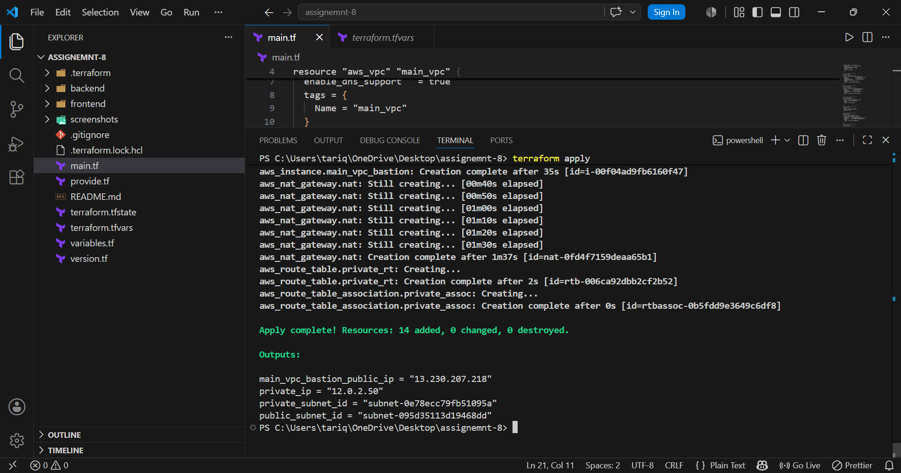

## AWS VPC
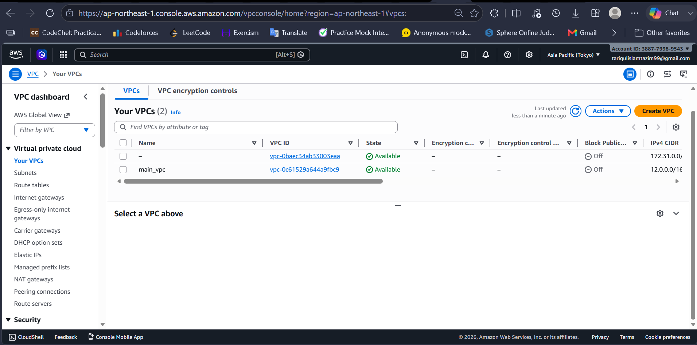

---

## Public and Private Subnets
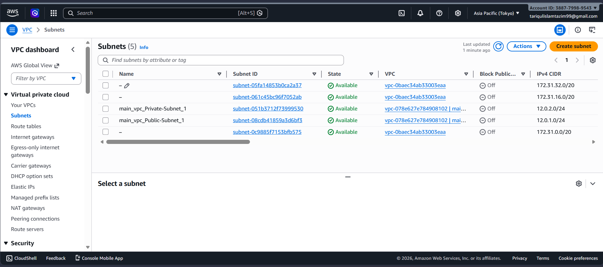

---

## EC2 Instance
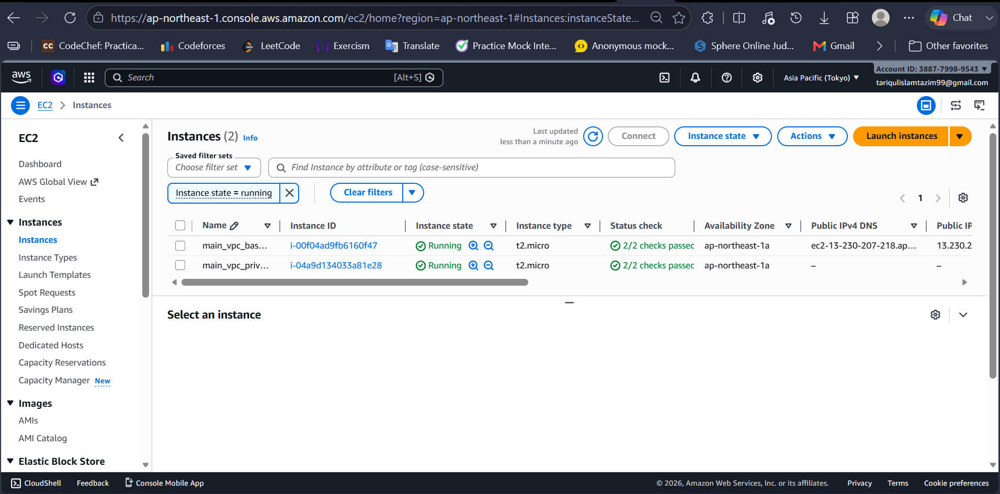

---

## Security Groups
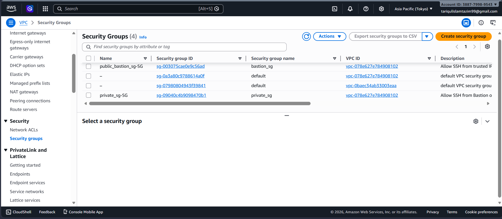

---

## Route Tables
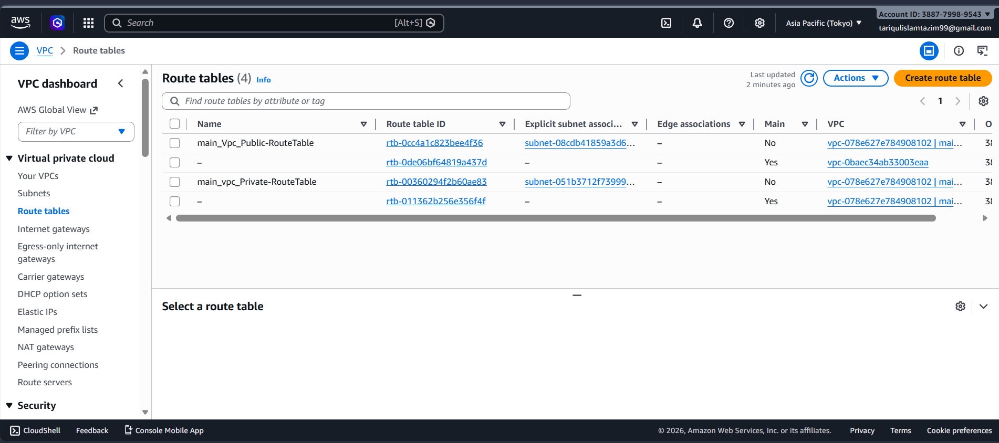

---

## Internet Gateway
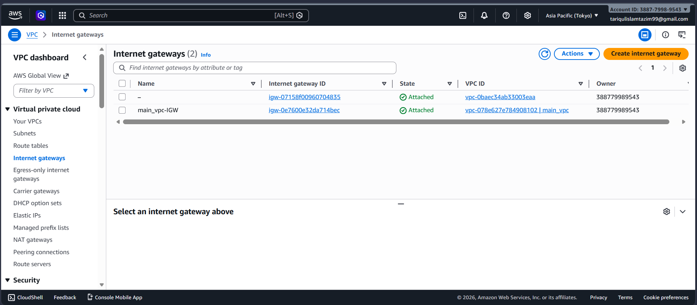

---

## NAT Gateway
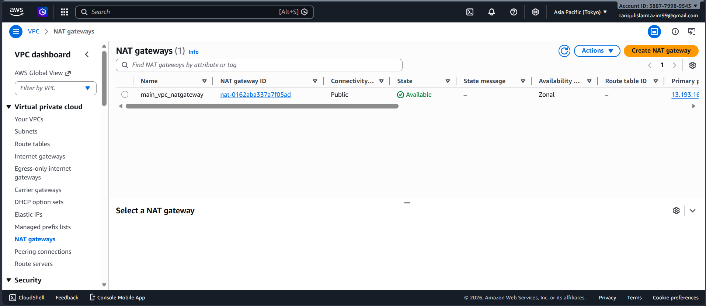

---

## Elastic IP
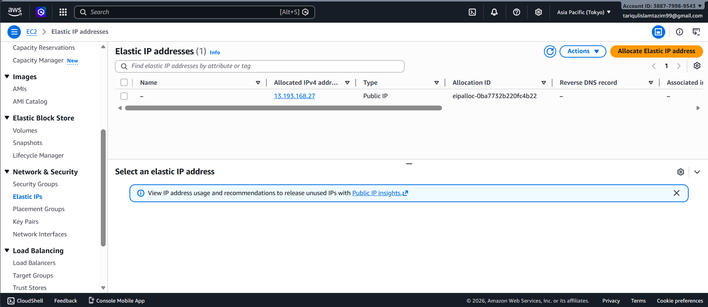

## GitHub Actions Workflow
Created a GitHub Actions CI workflow to automatically verify EC2 instance connectivity.

### Workflow Configuration
The workflow:
- Uses **Ubuntu Latest** GitHub runner
- Connects to EC2 instance through SSH
- Validates server connectivity
- Uses GitHub Actions Secrets for secure authentication

### Added Configuration
Configured the following secrets in GitHub Actions:

- `HOST` → EC2 public IP / hostname
- `USERNAME` → EC2 user
- `SSH_KEY` → Private SSH key

Example workflow:
```yaml

name: EC2 Connectivity Check

on:
  push:
    branches:
      - main
  workflow_dispatch:

jobs:
  check-ec2-connectivity:
    name: Verify EC2 Connection & Extract Metadata
    runs-on: ubuntu-latest
    
    steps:
      - name: Checkout Repository
        uses: actions/checkout@v4
      
      - name: Setup SSH Key
        run: |
          mkdir -p ~/.ssh
          echo "${{ secrets.EC2_SSH_KEY }}" > ~/.ssh/ec2_key
          chmod 600 ~/.ssh/ec2_key
          ssh-keyscan -H ${{ secrets.EC2_HOST }} >> ~/.ssh/known_hosts
      
      - name: Test EC2 Connectivity
        run: |
          echo "Testing SSH connection to EC2 instance..."
          ssh -i ~/.ssh/ec2_key -o ConnectTimeout=10 ${{ secrets.EC2_USER }}@${{ secrets.EC2_HOST }} "echo 'SSH connection successful!'"
      
      - name: Extract EC2 Metadata
        run: |
          echo "Extracting EC2 instance metadata..."
          ssh -i ~/.ssh/ec2_key ${{ secrets.EC2_USER }}@${{ secrets.EC2_HOST }} << 'EOF'
            echo "=================================================="
            echo "          EC2 Instance Information"
            echo "=================================================="
            
            # Get IMDSv2 token (required for metadata access)
            TOKEN=$(curl -s -X PUT "http://169.254.169.254/latest/api/token" \
              -H "X-aws-ec2-metadata-token-ttl-seconds: 21600")
            
            # Get hostname
            echo ""
            echo "Hostname:"
            hostname
            
            # Get public IP from AWS metadata service (IMDSv2)
            echo ""
            echo "Public IP Address:"
            curl -s -H "X-aws-ec2-metadata-token: $TOKEN" \
              http://169.254.169.254/latest/meta-data/public-ipv4 || echo "Unable to retrieve public IP"
            echo ""
            
            # Get private IP from AWS metadata service (IMDSv2)
            echo ""
            echo "Private IP Address:"
            curl -s -H "X-aws-ec2-metadata-token: $TOKEN" \
              http://169.254.169.254/latest/meta-data/local-ipv4 || echo "Unable to retrieve private IP"
            echo ""
            
            # Get instance ID
            echo ""
            echo "Instance ID:"
            curl -s -H "X-aws-ec2-metadata-token: $TOKEN" \
              http://169.254.169.254/latest/meta-data/instance-id || echo "Unable to retrieve instance ID"
            echo ""
            
            # Get availability zone
            echo ""
            echo "Availability Zone:"
            curl -s -H "X-aws-ec2-metadata-token: $TOKEN" \
              http://169.254.169.254/latest/meta-data/placement/availability-zone || echo "Unable to retrieve AZ"
            echo ""
            
            # Get instance type
            echo ""
            echo "Instance Type:"
            curl -s -H "X-aws-ec2-metadata-token: $TOKEN" \
              http://169.254.169.254/latest/meta-data/instance-type || echo "Unable to retrieve instance type"
            echo ""
            
            # System uptime
            echo ""
            echo "System Uptime:"
            uptime
            
            echo ""
            echo "=================================================="
            echo "          Connection Check Complete!"
            echo "=================================================="
          EOF
      
      - name: Cleanup SSH Key
        if: always()
        run: |
          rm -f ~/.ssh/ec2_key

---
##Screenshots
###GitHub Actions - EC2 Connectivity Test
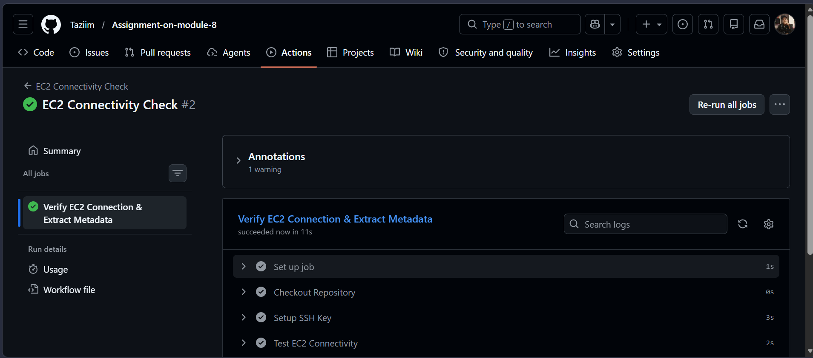

##Terraform Code
```main.tf
# -------------------------
# VPC
# -------------------------
resource "aws_vpc" "main_vpc" {
  cidr_block           = "12.0.0.0/16"
  enable_dns_hostnames = true
  tags = {
    Name = "main_vpc"
  }
}

# -------------------------
# Public Subnet
# -------------------------
resource "aws_subnet" "public_subnet_1" {
  vpc_id                  = aws_vpc.main_vpc.id
  cidr_block              = "12.0.1.0/24"
  availability_zone       = "ap-northeast-1a"
  map_public_ip_on_launch = true
  tags = {
    Name = "main_vpc_Public-Subnet_1"
  }
}

# -------------------------
# Private Subnet
# -------------------------
resource "aws_subnet" "private_subnet_1" {
  vpc_id            = aws_vpc.main_vpc.id
  cidr_block        = "12.0.2.0/24"
  availability_zone = "ap-northeast-1a"
  tags = {
    Name = "main_vpc_Private-Subnet_1"
  }
}

# -------------------------
# Internet Gateway
# -------------------------
resource "aws_internet_gateway" "igw" {
  vpc_id = aws_vpc.main_vpc.id
  tags = {
    Name = "main_vpc-IGW"
  }
}

# -------------------------
# Elastic IP
# -------------------------
resource "aws_eip" "nat_eip" {
  #domain = "vpc"
}

# -------------------------
# NAT Gateway
# -------------------------
resource "aws_nat_gateway" "nat" {
  allocation_id = aws_eip.nat_eip.id
  subnet_id     = aws_subnet.public_subnet_1.id
  depends_on    = [aws_internet_gateway.igw]
  tags = {
    Name = "main_vpc_natgateway"
  }
}

# -------------------------
# Route Tables
# -------------------------
resource "aws_route_table" "public_rt" {
  vpc_id = aws_vpc.main_vpc.id
  route {
    cidr_block = "0.0.0.0/0"
    gateway_id = aws_internet_gateway.igw.id
  }
  tags = {
    Name = "main_Vpc_Public-RouteTable"
  }
}

resource "aws_route_table" "private_rt" {
  vpc_id = aws_vpc.main_vpc.id
  route {
    cidr_block     = "0.0.0.0/0"
    nat_gateway_id = aws_nat_gateway.nat.id
  }
  tags = {
    Name = "main_vpc_Private-RouteTable"
  }
}

# -------------------------
# Route Table Associations
# -------------------------
resource "aws_route_table_association" "public_assoc" {
  subnet_id      = aws_subnet.public_subnet_1.id
  route_table_id = aws_route_table.public_rt.id
}

resource "aws_route_table_association" "private_assoc" {
  subnet_id      = aws_subnet.private_subnet_1.id
  route_table_id = aws_route_table.private_rt.id
}

# -------------------------
# Security Group - Bastion (Public)
# -------------------------
resource "aws_security_group" "bastion_sg" {
  name        = "bastion_sg"
  description = "Allow SSH from trusted IP"
  vpc_id      = aws_vpc.main_vpc.id

  ingress {
    description = "SSH Access"
    from_port   = 22
    to_port     = 22
    protocol    = "tcp"
    cidr_blocks = ["0.0.0.0/0"] # Restrict to your IP in production, e.g. ["YOUR.IP.ADDRESS/32"]
  }

  egress {
    from_port   = 0
    to_port     = 0
    protocol    = "-1"
    cidr_blocks = ["0.0.0.0/0"]
  }

  tags = {
    Name = "public_bastion_sg-SG"
  }
}

# -------------------------
# Security Group - Private Instance
# -------------------------
resource "aws_security_group" "private_sg" {
  name        = "private_sg"
  description = "Allow SSH from Bastion only"
  vpc_id      = aws_vpc.main_vpc.id

  ingress {
    description     = "SSH from Bastion"
    from_port       = 22
    to_port         = 22
    protocol        = "tcp"
    security_groups = [aws_security_group.bastion_sg.id]
  }

  egress {
    from_port   = 0
    to_port     = 0
    protocol    = "-1"
    cidr_blocks = ["0.0.0.0/0"]
  }

  tags = {
    Name = "private_sg-SG"
  }
}

# -------------------------
# EC2 Instances
# -------------------------
resource "aws_instance" "main_vpc_bastion" {
  ami                         = var.ami_id
  instance_type               = var.instance_type
  subnet_id                   = aws_subnet.public_subnet_1.id
  vpc_security_group_ids      = [aws_security_group.bastion_sg.id]
  associate_public_ip_address = true
  key_name                    = var.key_pair_name
  tags = {
    Name = "main_vpc_bastion_public"
  }
}

resource "aws_instance" "main_vpc_private" {
  ami                    = var.ami_id
  instance_type          = var.instance_type
  subnet_id              = aws_subnet.private_subnet_1.id
  vpc_security_group_ids = [aws_security_group.private_sg.id]
  key_name               = var.key_pair_name
  tags = {
    Name = "main_vpc_private"
  }
}

# -------------------------
# Outputs
# -------------------------
output "main_vpc_bastion_public_ip" {
  value = aws_instance.main_vpc_bastion.public_ip
}

output "private_ip" {
  value = aws_instance.main_vpc_private.private_ip
}
---

```provide.tf
provider "aws" {
  region     = var.aws_region
  access_key = var.my_access_key
  secret_key = var.my_secret_key
}
```terraform.tfvars
cannot add cause of github sensitive data violation

```variables.tf
variable "aws_region" {}
variable "my_access_key" {}
variable "my_secret_key" {}
variable "key_pair_name" {}
variable "ami_id" {}
variable "instance_type" {}

```version.tf
terraform {
  required_version = ">= 1.15.0"
  required_providers {
    aws = {
      source  = "hashicorp/aws"
      version = "~>5.0"
    }
  }
}

---

